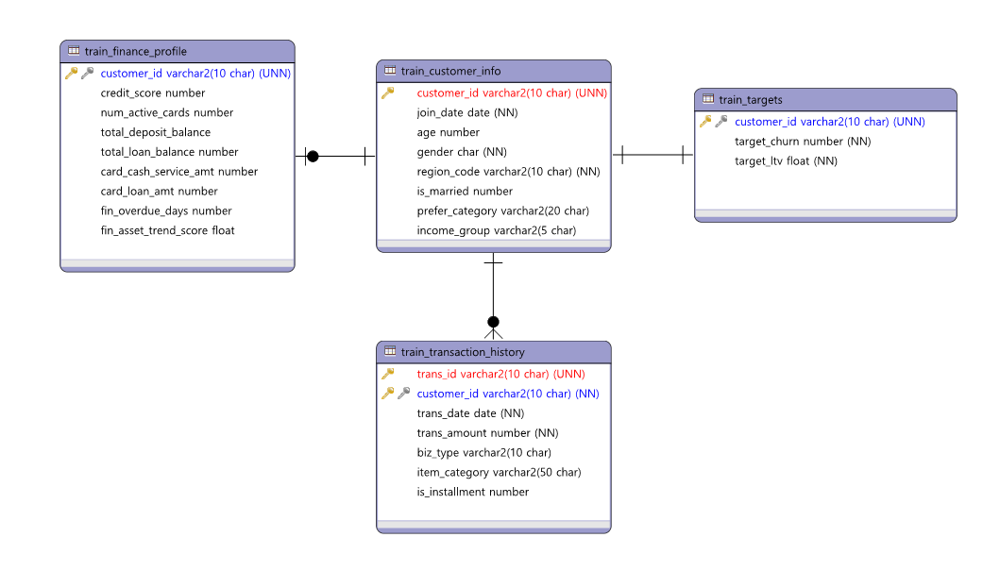
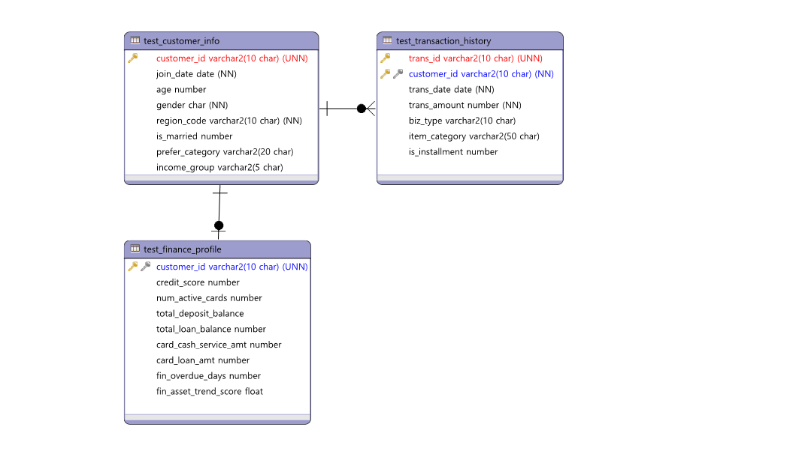

# 고객 이탈·LTV 예측 — 대회 출품작 및 사후 모델 재설계

> 한국데이터정보과학회 & SAS KOREA 제2회 데이터 분석 경진대회 출품작과, 대회 종료 후 단독으로 진행한 모델 개선 실험 결과물 통합 저장

## 개요

6만 명 가상 고객의 3개 이종 테이블을 결합해 **이탈 확률(AUC)** 과 **1년 LTV(RMSE)** 를 동시 예측하는 과제. 대회에서 0.794로 수렴한 모델을, 종료 후 검증 체계 재설계를 통해 **Churn AUC 0.7943 → 0.7982**로 개선함. 나아가 개선의 주동력으로 지목된 튜닝 효과를 AB Test로 재검증함.

```
baseline/   대회 종료 시점 결과물 (출발점)
improved/   사후 재설계 (진단 → 실험 → 개선 → 가설검증)
docs/       제공 데이터 ERD
```

---

## 1. 대회 개요

- **주최:** 한국데이터정보과학회 & SAS KOREA 제2회 데이터 분석 경진대회
- **과제:** 고객별 ① 향후 1개월 내 **이탈 확률**, ② 향후 1년 **LTV 금액** 동시 예측
- **채점:** 두 지표의 가중 평균 `Score = 0.5 × AUC(Churn) + 0.5 × 1/(1+log(SE(LTV)))`
- **형식:** 주 1회 제출로 5주간 리더보드 경쟁

**역할 분배**
- **권지수(팀장):** 데이터 전처리·EDA, 피처 엔지니어링, 모델링·튜닝, 검증 설계 등 분석 및 실험 주도
- **권지원:** 모델 베이스라인 설계, 튜닝 실험 및 제출물 정리 보조

## 2. 데이터

3개의 이종 테이블과 1개의 정답 테이블을 `customer_id` 기준으로 결합해 사용.

| 테이블 | 내용 | 변수 |
|---|---|---|
| customer_info | 고객 기본정보(데모그래픽) | 7 |
| transaction_history | 리테일 구매이력 (시계열, 2023.07–12) | 6 |
| finance_profile | 금융자산 스냅샷 (신용·예적금·대출·연체 등) | 8 |
| targets | 이탈 여부 · LTV 정답 (학습용) | 2 |

학습 6만 명 / 평가 4만 명(정답 비공개), 평가셋은 Public(2만)·Private(2만)으로 분할

### 제공 데이터 ERD



## 3. 기존 모델링 의사결정 및 결과물

대회 5주간 내린 주요 의사결정은 다음과 같음.

- **피처:** 3개 테이블에서 50개 이상의 파생 피처 생성. 그중 `fin_asset_trend_score`(자산 변동 추세) 단변량 분리력이 가장 높아 핵심 피처로 판단
- **모델:** LightGBM · XGBoost 앙상블
- **타겟:** 이탈(분류)·LTV(회귀)를 각각 모델링, LTV는 2-stage로 설계
- **검증:** 리더보드 점수 기준으로 주차별 가설을 반복 검증

**결과:** 1주차 베이스라인(0.788) 이후 2주차부터 0.794에서 수렴. 무엇이 점수에 기여하고, 무엇이 노이즈인지 명확하지 않은 상태로 종료됨

## 4. 사후 개선 실험의 출발점

대회 종료 시점의 미해결 과제는 세 가지로 정리됨.

- 5주간 AUC가 정체된 원인을 규명하지 못함
- 핵심 피처·검증 설계 등 주요 의사결정을 데이터 검증 없이 직관에 의존함
- CV 점수와 리더보드 점수의 괴리를 추적할 수단이 부재함

이에 모델 재설계에 앞서, 기존 의사결정이 올바른 전제 위에 있었는지를 먼저 검증하는 방향으로 사후 실험을 설계함.

## 5. 개선 과정 (진단 → 실험 → 결과)

### 진단: 가설을 데이터로 검증

기존 의사결정을 각각 *문제점 → 원인 추측(가설) → 직접 확인* 으로 분해해 검증함.

- **피처 과다 → 중요도 왜곡:** null importance(타겟 셔플) z-score 검정 결과, 핵심으로 판단했던 `fin_asset_trend_score`가 실제로는 **noise(z≈-0.9)** 로 확인됨. 단변량 분리력 1위였으나 타 금융 피처와 정보가 중복되어 모델 기여가 0이었던 split-importance 착시 사례.
- **CV-LB 괴리 → 분포 불일치 의심:** adversarial validation으로 검증 → **AUC 0.4995(구분 불가)로 분포 불일치가 존재하지 않음을 반증.** 대회 중 분포 차이의 근거(`is_married` "Train 95% vs Test 65%")로 삼았던 수치가 집계 오류(실제 65.1% vs 64.7%)였음이 드러남.
- **거래 피처 신호 확인:** Mann-Whitney U·effect size 검정 결과, 거래 피처 31종에는 유의한 신호가 거의 없고 신호가 금융자산 프로파일에 집중됨을 확인.
- **평가 지표 재해석:** 상위팀 실측 Score로 채점식을 역산 → 로그가 상용로그(log10)·RMSE가 원본 스케일임을 확인. LTV term이 평탄 구간에 위치해 **AUC 0.001 개선이 RMSE 5만 원 개선보다 약 6배 큰 점수 기여**를 가짐을 도출. 역량을 Churn AUC에 집중하는 근거가 됨.

### 실험

- 검증 스킴을 5-fold StratifiedKFold로 고정: 신뢰 가능한 피처셋 선확보
- null importance 기반 피처셋 실측 비교: 추측 아닌 데이터 기반 선택
- 학습 메커니즘이 상이한 모델(CatBoost · RandomForest)을 앙상블 다양성 목적으로 도입
- 피처 서브셋 분할, 거래피처 재설계: 효과가 없거나 마이너스. 기각 근거와 함께 기록함

### 결과

| 구분 | Churn AUC |
|---|---|
| 기존 (대회 종료) | 0.7943 |
| **개선 (사후)** | **0.7982 (+0.0039)** |

- 실험별 기여도 분해 결과 **하이퍼파라미터 튜닝(+0.0045)**이 핵심
- 피처셋 비교: full(43개) 0.7963 < **denoised(10개) 0.7975** → 노이즈 피처가 일반화 성능을 해치는 것을 정량적으로 확인함

## 6. 가설 검증 — 튜닝 효과 gap 원인 규명

위 결과에 따르면 개선 모델의 성능 향상에 가장 크게 기여한 것은 Optuna 튜닝인 것으로 확인됨. 그러나 대회 당시에 Optuna 튜닝을 시도했음에도 AUC가 오히려 악화(-0.0021)되어 기각한 기록이 있었기 때문에, 두 결과가 모순되는 원인을 정량적으로 규명할 필요가 있다고 판단함. 따라서 "이전에 실패했던 튜닝 실험이 개선 모델에서는 효과를 낸 이유"를 검증 대상으로 설정 후 아래 AB Test를 진행함.

- **설계:** 미정돈 피처셋(대회 5주차 49개)과 정돈 피처셋(denoised 10개)에 **동일한 탐색공간·trial 수·시드·CV 분할**로 튜닝을 적용하는 2×2 비교.

- **결과:** 두 피처셋의 튜닝 효과 차이를 계산한 결과 **"미정돈 피처셋 튜닝 효과 − 정돈 피처셋 튜닝 효과 = +0.00237"**로, 정돈된 피처셋에서 튜닝 효과가 유의하게 더 큼. best_params 비교 결과에 따라 미정돈 피처셋에서는 Optuna가 49개 피처의 고차원 탐색공간에서 동일 trial 예산으로 적정 정규화 강도에 도달하지 못한다는 것이 튜닝 효과 차이의 원인으로 확인됨.

- **시사점:** 튜닝 효과의 차이는 튜닝 기법이 아니라 **탐색 난이도**에서 비롯됨. 즉 피처셋 정돈은 튜닝의 탐색 비용을 낮추는 선행 작업이며, 검증·신호 진단이 선행되어야 튜닝 효과가 증폭되는 순차적 관계가 정량적으로 확인됨.

## 기술 스택

`Python` (pandas · scikit-learn · LightGBM · XGBoost · CatBoost · Optuna) · `SAS Viya`(EDA)

## 상세 보고서

📄 **자세한 진행 과정 및 개선 결과: [`reports/improvement_report.md`](reports/improvement_report.md)**